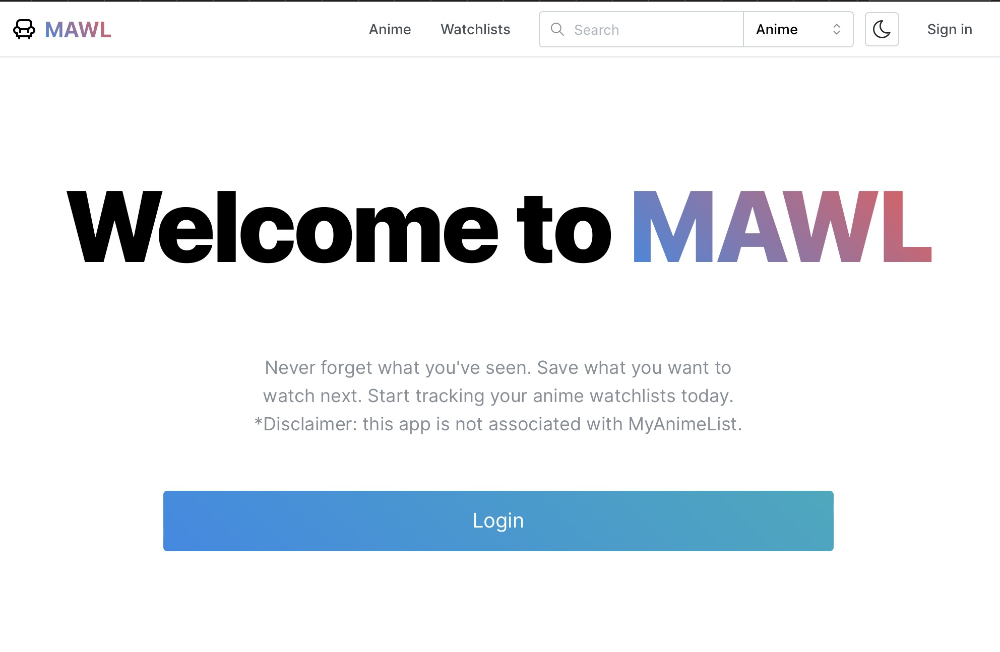

# My Anime Watch List

Anime watchlist tracker based off [Kitsu.io](https://kitsu.io/explore/anime)



## Stack

- Frontend: Next.js (App Router), React, TypeScript, Mantine, TailwindCSS, CSS Modules (yes)
- Backend: Next.js/Node.js, Supabase + PostgreSQL
- Authentication: Supabase Auth (JWT/session-based)
- 3rd party API: [Kitsu API](https://kitsu.docs.apiary.io/#) (anime discovery platform)

## API

This also includes a RESTful CRUD API for the following resources:

- [x] `/api/users`
  - [x] `GET`: (_protected_) Get the user information of an authenticated user via authorization tokens
- [ ] `/api/users/:userId`
  - [ ] `GET`: Get the public user information of a given user via their id
- [x] `/api/anime`
  - [x] `GET`: Search and return a collection of anime, given query parameters
- [ ] `/api/anime/:animeId`
  - [x] `GET`: Retrieve the anime resource given the associated anime id. Also include any associated resources associated with this anime and an authenticated user (user ratings, watch status, watchlists added)
  - [x] `PATCH`: (_protected_) Update anime status associated with the user (ratings, watch status)
  - [ ] `DELETE` (_protected_) Remove anime status associated with the user (ratings, watch status)
- [ ] `/api/watchlists`
  - [ ] `GET`: Search and return a collection of public watchlists, given query parameters. For an authenticated user, this would include any private watchlists for that specific user as well.
  - [ ] `POST`: (_protected_) Create a new watchlist.
- [ ] `/api/watchlists/:watchlistId`
  - [ ] `GET`: Retrieve the watchlist resource given the associated watchlist id.
  - [ ] `PUT`: (_protected_) Update the watchlist metadata (name, description, public)
  - [ ] `POST`: (_protected_) Add an anime to the watchlist
  - [ ] `DELETE`: (_protected_) Delete the watchlist
- [ ] `/api/watchlists/:watchlistId/anime/:animeId`
  - [ ] `DELETE`: (_protected_) Remove the anime from the watchlist

## Contributing

1. Make sure to install and enable the correct `pnpm` version. Also make sure to use nvm to use the correct node version.

```sh
corepack enable
nvm use
```

2. Install the packages with `pnpm`:

```sh
pnpm install
```

3. Copy `.env.example` into `.env` and add the configured supabase credentials.

4. Once supabase credentials are set up, run the following to generate the correct up-to-date types:

```sh
# Login to supabase and get credentials
pnpm supabase login

# Generate types
pnpm supabase gen types typescript --project-id {YOUR_PROJECT_ID} --schema public > src/types/generated/supabase.ts && pnpm eslint --fix src/types/generated/supabase.ts
```

5. Run the development server and go to [http://localhost:3000](http://localhost:3000) to see the result:

```sh
pnpm dev
```
