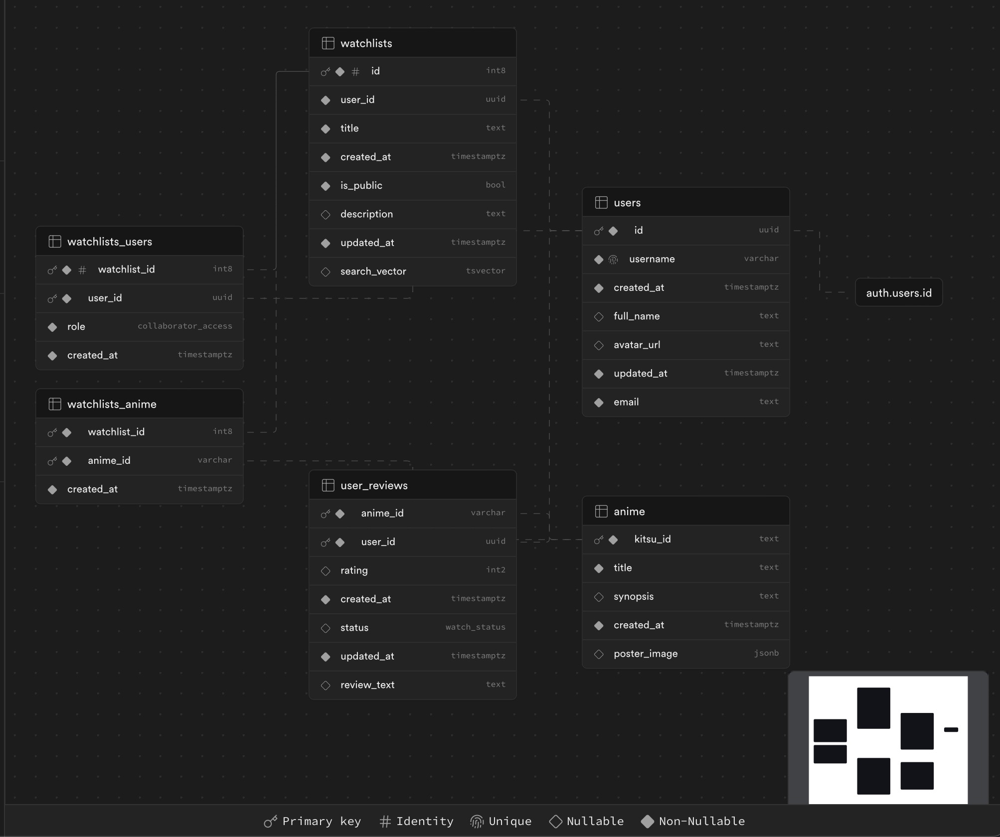

# My Anime Watch List

Anime watchlist tracker based off [Kitsu.io](https://kitsu.io/explore/anime)


## Stack

- Frontend: Next.js (App Router), React, TypeScript, Mantine, TailwindCSS, CSS Modules (yes)
- Backend: Next.js/Node.js, Supabase + PostgreSQL
- Authentication: Supabase Auth (JWT/session-based)
- 3rd party API: [Kitsu API](https://kitsu.docs.apiary.io/#) (anime discovery platform)

## API

This also includes a RESTful CRUD API for the following resources:

- [x] `/api/users`
  - [x] `GET`: (_protected_) Get the user information of an authenticated user via authorization tokens
- [x] `/api/users/:username`
  - [x] `GET`: Get public user information associated with the user. For now, this is just the user id and username.
- [x] `/api/users/:username/watchlists`
  - [x] `GET`: Get the public watchlists associated with the user by their username. For an authenticated user, this would include any private watchlists for that specific user as well.
- [ ] `/api/users/:username/anime`
  - [ ] `GET`: Get all anime related to user (rated, marked status, added to watchlist)
- [x] `/api/anime`
  - [x] `GET`: Search and return a collection of anime, given query parameters
- [x] `/api/anime/:animeId`
  - [x] `GET`: Retrieve the anime resource given the associated anime id. Also include any associated resources associated with this anime and an authenticated user (user ratings, watch status, watchlists added)
  - [x] `PATCH`: (_protected_) Update anime status associated with the user (ratings, watch status)
  - [x] `DELETE`: (_protected_) Remove anime status associated with the user (ratings, watch status)
- [ ] `/api/watchlists`
  - [ ] `GET`: Search and return a collection of public watchlists, given query parameters. For an authenticated user, this would include any private watchlists for that specific user as well.
  - [ ] `POST`: (_protected_) Create a new watchlist.
- [ ] `/api/watchlists/:watchlistId`
  - [x] `GET`: Retrieve the watchlist resource given the associated watchlist id.
  - [ ] `PUT`: (_protected_) Update the watchlist metadata (name, description, public)
  - [x] `POST`: (_protected_) Add an anime to the watchlist
  - [x] `DELETE`: (_protected_) Delete the watchlist
- [x] `/api/watchlists/:watchlistId/users`
  - [x] `GET`: (_protected_) Get collaborators for the watchlist
  - [x] `POST`: (_protected_) Add a collaborator to the watchlist (editor, viewer)
- [ ] `/api/watchlists/:watchlistId/users/:userId`
  - [ ] `PATCH`: (_protected_) Update collaborator role in the watchlist
  - [ ] `DELETE`: (_protected_) Remove a collaborator from the watchlist
- [x] `/api/watchlists/:watchlistId/anime/:animeId`
  - [x] `DELETE`: (_protected_) Remove the anime from the watchlist

## Data Schema

This leverages Postgres features extensively, including using JSON validation, row-level security policies, and others. The data schema is as follows:

- `anime`: Saved anime resources from Kitsu (used to minimize dependency on Kitsu for watchlists)
- `users`: User profile information that is publicly accessible. Note `id` links to the UUID `auth.users.id` column
- `user_reviews`: User reviews on anime watch status and ratings
- `watchlists`: User anime watchlists
- `watchlists_anime`: Anime added to watchlists



## Contributing

1. Make sure to install and enable the correct `pnpm` version. Also make sure to use nvm to use the correct node version.

```sh
nvm use
corepack enable
```

2. Install the packages with `pnpm`:

```sh
pnpm install
```

3. Copy `.env.example` into `.env` and add the configured supabase credentials.

4. Once supabase credentials are set up, run the following to generate the correct up-to-date types:

```sh
# Login to supabase and get credentials
pnpm db:login

# Generate types
pnpm gen:types
```

5. Run the development server and go to [http://localhost:3000](http://localhost:3000) to see the result:

```sh
pnpm dev
```
